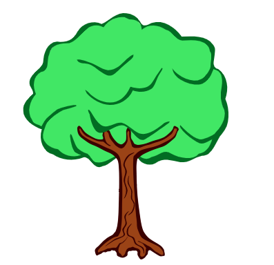
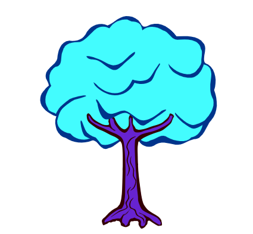

# Crypto Apple Tree NFT Whitepaper
Official whitepaper for the Crypto Apple Trees project.

_Note: This document is still a work in progress!_


<div >
  




 </div>
  
<br/>


## Abstract

The Crypto Apple Trees is an innovative project of interest-bearing NFTs that literally _bear fruits_ that grow in real time. 


<br/>


## Dividend Paying NFTs

Unlike other NFTs, apple tree NFTs grow APPLE token over time. This APPLE can periodically be can be harvested (ie. minted) by the owner of the tree, and some APPLE token goes right into the owner's wallet.

_Think "farming simulator" but with real crypto being grown!_

<br/>


## Tech

The technology behing the Crypto Apple Trees project is a set of Solidity smart contracts and websites for interacting with them via web3.

Crypto Apple Trees will go live on the MATIC mainnet network (currently being tested on the MATIC Mumbai testnet). We believe this is the best network because it has very low gas fees, supports Solidity smart contracts, and has a proven track record of supporting large, popular web3 games such as zed.run and Decentraland.

The client for connecting to our smart contracts is a browser web application built with React.

The APPLE token will be a slightly modified erc20 smart contract.

The TREE NFT connection will be a slightly modified Erc721 contract.

The DAO token will be a slightly customized erc20 token smart contract, also deployed on MATIC mainnet, with the "snapshot" platform providing proposals and voting functionality.

All smart contracts will be deployed from the command line and have extensive unit testing.

<br/>

## APPLE - The Core Game Currency

The APPLE token can be spent on a few different things on the Apple Trees website.

1. Buying TREEs - Owners can list TREEs for sale in the apple tree marketplace, and users can purchase them with APPLE.

_Note: In the game marketplace users can only list TREEs for sale in terms of APPLE. However, since TREEs follow the ERC721 standard TREEs can also be sold on third party marketplaces such as OpenSea for other cryptocurrencies such as ETH, MATIC, or DAI._

2. Breeding TREEs - Owners can list TREEs as "available for breeding", and users pay APPLE to breed with it and keep the offspring, whose stats are a combination of those that the parents have.

3. Eating APPLE - On the site there is a little form that allows users to "eat" some amount of their APPLE tokens. Any APPLE that is eaten gets destroyed (or _burned_, in crypto terms). Every user address has a "nutrition score", and eating APPLE increases the nutrition score associated with that adderss that ate the APPLE. The benefit of increasing your nutrition score is that every time some APPLE is harvested, the amount harvested is slightly influenced by the owner's nutrition score, producing more APPLE for higher nutrition scores.

4. Selling APPLE - Suppose you want to take some of your APPLE and cash out- maybe you want to buy some other NFTs, or maybe you want to convert some to another cryptocurrency like Ether or Bitcoin. Since the APPLE token follows the ERC20 standard, it can be traded on decentralized exchanged on the MATIC network, such as sushiswap. We will also work to get APPLE listed on centralized exchantes such as Coinbase and Kucoin. 


<br/>


## ZERO Initially Minted APPLE, No "Backdoor Minting" Functionality

In the spirit of fairness and transparency, the APPLE token can ___ONLY___ be minted by the TREE smart contract.

There are no APPLE tokens minted upfront and no other way for the contract owner to mint APPLE directly.

This is a stark contrast to many projects that mint a massive supply to the project creators (either initially or over time) prowe have decided to not 

<br/>


## TREEs - The NFT Collection

The NFTs in this world are all apple trees. Each apple tree is born with various immutable stats that control various parameters, for example how long is takes for the tree to grow harvestable APPLE.

<br/>

## Gen Zero Trees

Gen Zero (generation zero) TREEs are created by the DAO (see gen zero minting guidelines for more info). These TREEs will be either immediately put up for sale publicly in the game marketplace (with the DAO as the sale beneficiary) _or_ they will be minted to a member of one of the gen zero beneficiary groups.

<br/>


## TREE Breeding
Two TREE NFTs can be bred together to create an offspring TREE! 

The breeding process is relatively simple:

1. User A lists his or her TREE for breeding at some price in APPLE token (above or equal to the minimum breeding price)

2. User B pays the asking of APPLE, immediately triggering a new TREE to be minted to user B. The offspring TREE NFT has trait values that are exactly the averages of the parents TREEs' traits (no randomness!).

<br/>

## Minimum Breeding Price
In order to stifle an otherwise exploding supply of TREEs, we have built in a minimum price at which TREEs must be listed. This price is calculated dynamically and fluctuates based on the total supply of TREE NFTs, total supply of APPLE, and ___. See appendix B for more details on how the minimum breeding price is calculated.


<br/>

## In-Game Marketplace
Users will have the ability to buy and sell TREEs directly in our website.

Users can:

- list their TREEs for sale
- cancel a listing for one of their TREEs
- purchase a TREE for sale

_Note: Our webapp will __only__ support buying and selling with the APPLE token. However, since the TREE NFTs follow the Erc721 standard, they can easily be purchased and sold using other cryptocurrencies on other exchanges (eg. OpenSea)_

Minimum price: 1 APPLE

<br/>

## Advantages of the In-Game Marketplace over OpenSea

- Other users in the game are constantly collecting APPLE and looking for ways to spend it.
- We plan to charge a 0.5% less commission than competitors like OpenSea (who currently charge 2.5% on every transaction!)  

<br/>

## AppleTree DAO Token

The AppleTree Dao Token (ATDT) is a governance token for the AppleTreeNFT project.

Holders of this token will be able to create and vote on proposals for the project.

Holders of this token will also be elligible for "dividend payouts" from the Treasury when a proposal to distribute funds is passed.

<br/>

## AppleTree Treasury

The Treasury collects all funds for which the DAO is the beneficiary.

The DAO makes revenue from 3 activities in the game:

- Sale of gen zero TREEs where the DAO is the beneficiary

- Commissions from breeding

- Commissions from in-game marketplace

<br/>

## Why Apple & Trees
Apples are one of the purest form of food in existence, dating back to the very origins of man. We hope that this project inpires our users to conenct more with nature- to go outside, to travel more, to eat more raw plants, and to live their besat lives!

<br/>


## APPENDIX A - Apple Production Calculation


So, how does the TREE contract know how much to APPLE to mint?

The amount of APPLE minted depends on this calculation, which will look something like this:

```
APPLE_MINTED = floor + multiplier_constant * growth_strength * tree_age^2 / (tree_age^2 + balancer_constant / fibonacci_nutrition_score)
```

### Constants:

floor: 1 APPLE

multiplier_constant: 10

balancer_constant: 5


### Variables

tree_age: number of years (as a decimal) since the TREE was minted

growth_strength: an unchanging trait given to each TREE when minted (between 1 and 10)

fibonacci_nutrition_score: incorporates the nutrition score into the calculation, but uses the fibonacci series to keep whale accounts from becoming unfairly overpowered. 


<br/>


## APPENDIX B - Breeding Cost Calculation

In order to limit an explosion of breeding and TREEs we implement a _minimum breeding cost_ that must be charged for breeding.

```
MIN_BREEDING_COST = floor + sqrt(supply_of_APPLE) * sqrt(supply_of_TREEs) * percentage_factor
```

### Constants:

floor: 10 APPLE

percentage_factor: 5


### Variables

sqrt(supply_of_APPLE): the square root of the total supply of uneaten APPLE tokens in existence

sqrt(supply_of_TREEs): the square root of the total supply of TREE NFTs in existence

<br/>

